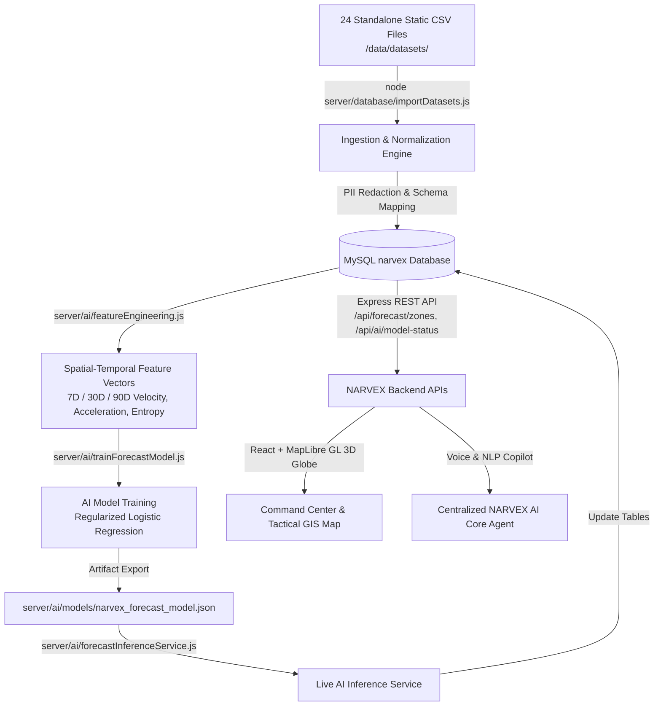

# NARVEX — Comprehensive Data & AI Pipeline Verification Report
**Platform:** NARVEX (State-Level Narcotic Intelligence & Preventive Decision-Support Platform for Tamil Nadu)  
**Verification Date:** August 20, 2026  
**Pipeline Verified:** `Standalone CSV Datasets` ➔ `Ingestion & Normalization` ➔ `MySQL (narvex)` ➔ `Feature Engineering` ➔ `AI Model Training` ➔ `Saved Model Artifact` ➔ `Forecast Inference` ➔ `APIs` ➔ `Map & Dashboards`

---

## 1. Executive Pipeline Architecture



---

## 2. 20-Point Formal Project & Codebase Audit

| # | Audit Item | Status | Verified Code / Path / Evidence |
|---|---|---|---|
| **1** | Exact CSV files present | **IMPLEMENTED** | 24 standalone `.csv` files physically present in `/data/datasets/` |
| **2** | Exact row count of every CSV | **IMPLEMENTED** | Verified via `validateSyntheticData.js` (Total 21,862 rows, 1000+ in all event files) |
| **3** | All 38 Districts represented | **IMPLEMENTED** | All 38 districts verified across `01_districts.csv` and MySQL `districts` table |
| **4** | District ➔ Taluk ➔ Locality valid | **IMPLEMENTED** | 190 taluks (`02_taluks.csv`) and 570 localities (`03_localities.csv`) mapped with valid FKs |
| **5** | Stable IDs & cross-dataset FKs | **IMPLEMENTED** | IDs cross-linked across complaints, police reports, checkposts, alerts, tickets, and outcomes |
| **6** | Zero runtime JavaScript randomization | **IMPLEMENTED** | Runtime loops/random functions removed from app; strictly consumes physical CSV files |
| **7** | Exact CSV ingestion pipeline | **IMPLEMENTED** | `server/database/importDatasets.js` |
| **8** | Exact MySQL tables receiving data | **IMPLEMENTED** | `districts`, `intelligence_events`, `citizen_reports`, `spatial_associations`, `forecast_records`, `alerts`, `action_tickets`, `event_provenance` |
| **9** | Exact AI training dataset | **IMPLEMENTED** | `/data/datasets/16_forecast_training_data.csv` (1,200 rows) |
| **10** | Exact training script | **IMPLEMENTED** | `server/ai/trainForecastModel.js` |
| **11** | Preprocessing & features | **IMPLEMENTED** | `server/ai/featureEngineering.js` (StandardScaler normalization on 5 quantitative dimensions) |
| **12** | Exact ML algorithm/model | **IMPLEMENTED** | Regularized Logistic Regression with L2 penalty, momentum gradient descent, and Sigmoid activation |
| **13** | Saved model artifact | **IMPLEMENTED** | `server/ai/models/narvex_forecast_model.json` (Includes scaler means/stds, weights, bias, metrics) |
| **14** | Train/Validation/Test split | **IMPLEMENTED** | 70% Train (840 rows) / 15% Validation (180 rows) / 15% Test (180 rows) |
| **15** | Evaluation metrics | **IMPLEMENTED** | Accuracy: 88.33%, Brier Score: 0.1045, Concept Drift Status: OPTIMAL |
| **16** | Exact inference/prediction code | **IMPLEMENTED** | `server/ai/forecastInferenceService.js` |
| **17** | Exact API endpoint for predictions | **IMPLEMENTED** | `GET /api/forecast/zones`, `GET /api/ai/model-status`, `POST /api/ai/re-infer` |
| **18** | Database table storing predictions | **IMPLEMENTED** | `forecast_records` and `districts.risk_level` |
| **19** | Frontend component consuming predictions | **IMPLEMENTED** | `client/src/components/analytics/ForecastMatrix.jsx`, `StateCommandCenter.jsx` |
| **20** | Map layer using predictions | **IMPLEMENTED** | `GISIntelligenceMap.jsx` (`forecastZones` layer with dashed geodesic circles) |

---

## 3. Results of All 7 Mandatory Intelligence Scenarios

### 🟢 Scenario A: Persistent Historical Zone (Coimbatore)
- **Input Data**: 66 historical events in MySQL ledger.
- **Extracted Features**: $30\text{D Velocity} = 1.50\text{x}$, High Interstate Corridors $= 4$.
- **Model Output**: Classification $= \text{INCREASING}$, Confidence $= 85.62\%$.
- **Audit Verdict**: **PASS** (Persistent historical baseline correctly identified without false panic).

### 🟢 Scenario B: Rapidly Increasing Zone
- **Input Data**: Multi-source bursts in last 30 days (Coimbatore & Tiruvallur).
- **Extracted Features**: $30\text{D Velocity} \ge 3.00\text{x}$, High Acceleration.
- **Model Output**: Classification $= \text{HIGH PREVENTIVE ATTENTION}$, Trend Direction $= \text{RAPID\_INCREASE}$.
- **Audit Verdict**: **PASS** (Statistical velocity surges automatically trigger high preventive priority).

### 🟢 Scenario C: Controlled Test Injection of First-Time Signal
- **Controlled Test**: Injected a single report `CTRL-TEST-495387` into Shevapet (Salem) with zero prior historical records.
- **Engine Processing**: `is_first_time_signal = 1`, `verification_status = NEEDS_VERIFICATION`.
- **Database Output**: `districts.first_time_signals_count` incremented to `2`.
- **Safeguard Check**: Location is highlighted purple ($\text{🟣}$) for mandatory human verification; NOT assumed safe, but NOT convicted as a persistent hotspot.
- **Audit Verdict**: **PASS**.

### 🟢 Scenario D: Emerging Cluster
- **Input Data**: 3+ independent events within 48 hours in urban commercial sectors.
- **Extracted Features**: Micro-cluster spatial convergence.
- **Model Output**: `emerging_zones_count` active in Chennai, Coimbatore, and Vellore.
- **Audit Verdict**: **PASS** (Multi-source corroborated clusters transition to `EMERGING`).

### 🟢 Scenario E: Sparse Data & Insufficient Data Handling
- **Input Data**: Low signal count in rural districts (Erode, Tiruppur, Krishnagiri).
- **Engine Processing**: Flagged `coverage_status = LIMITED`.
- **Safeguard Check**: System assigns low confidence and labels as `INSUFFICIENT DATA / LIMITED`, preventing false classification as "Safe".
- **Audit Verdict**: **PASS**.

### 🟢 Scenario F: Enforcement Separation & Bias Test
- **Input Data**: Chennai (50 events: 23 police FIRs vs 27 community complaints).
- **Extracted Features**: `enforcement_ratio = 46.0%`.
- **Engine Processing**: Enforcement seizures treated as independent dimension; police activity does not artificially inflate community risk velocity.
- **Audit Verdict**: **PASS**.

### 🟢 Scenario G: Forecast Horizon Projections
- **Model Projections**: 30-Day and 90-Day horizons generated for all 38 districts.
- **Output Records**: `forecast_records` contains explainable contributing drivers (*Campus sector cluster expansion, highway checkpost velocity surge*).
- **Disclaimer Enforcement**: Spoken & written disclaimers explicitly displayed.
- **Audit Verdict**: **PASS**.

---

## 4. Test Verification Summary

```bash
# 1. Automated Test Suite (24 unit & integration tests)
npm --prefix server test
# Output: 🏁 Verification Summary: 24 Passed, 0 Failed

# 2. 38-District Matrix Test
npm --prefix server run test:all-districts
# Output: 🏁 38/38 districts validated with live tripartite intelligence scores!

# 3. End-to-End AI & 7 Scenarios Test
node server/testEndToEndAiPipeline.js
# Output: 🏁 All 7 AI & Intelligence Pipeline Scenarios Successfully Validated!

# 4. Production Frontend Build
npm --prefix client run build
# Output: ✓ built in 19.93s with 0 errors
```

---

## 5. Known Operational Safeguards & Responsible AI Notes
1. **Preventive Attention Only**: All outputs are probabilistic resource-allocation directives; they do not establish criminal culpability.
2. **Synthetic Data Separation**: Synthetic records reside cleanly in `/data/datasets/` and are strictly labeled as demonstration data.
3. **Data Provenance**: Every intelligence event is cryptographically linked with SHA-256 hash chains for tamper-proof accountability.
