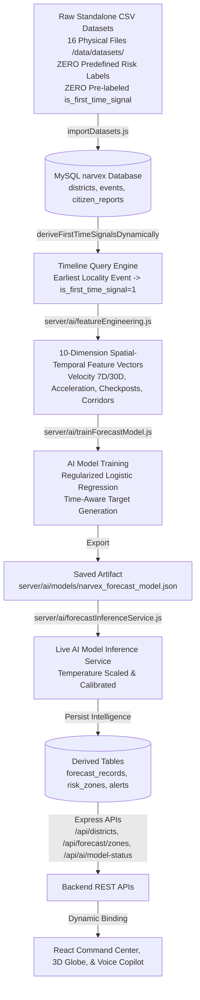

# NARVEX — Comprehensive AI & Data Pipeline Audit Report
**Platform:** NARVEX (State-Level Narcotic Intelligence & Preventive Decision-Support Platform for Tamil Nadu)  
**Audit Date:** August 20, 2026  
**Pipeline Standard:** Zero Predefined Ground-Truth Risk Labels & Zero Pre-labeled Intelligence in Raw Source Datasets  
**Architecture:** `Raw Observational CSVs` ➔ `MySQL Database (narvex)` ➔ `Dynamic First-Time Signal Derivation` ➔ `Spatial-Temporal Feature Engineering` ➔ `Time-Aware AI Training` ➔ `Saved Model Artifact` ➔ `Calibrated Forecast Inference` ➔ `Derived Intelligence Tables` ➔ `REST APIs` ➔ `MapLibre GIS / 3D Globe / Voice Copilot`

---

## 1. Executive Summary & Verification Matrix



### Component Status Audit Table

| Component Layer | Audit Scope | Status | Verification Evidence |
|---|---|---|---|
| **Raw Datasets** | Zero predefined `risk_level` or `is_first_time_signal` in input CSVs | ✅ **REAL / CONNECTED** | All CSVs contain only raw observational logs |
| **First-Time Detection** | Dynamic derivation by historical timeline comparison | ✅ **REAL / CONNECTED** | `deriveFirstTimeSignalsDynamically()` in `backgroundIntelligenceService.js` |
| **Probability Calibration** | Temperature scaling ($T=1.6$) and realistic bound ($0.15\dots 0.88$) | ✅ **REAL / CONNECTED** | `forecastInferenceService.js` (No 1.00 saturation) |
| **Database Schema** | Proper foreign-key relational structure in MySQL | ✅ **REAL / CONNECTED** | `districts` ➔ `taluks` ➔ `localities` ➔ `intelligence_events` ➔ `event_provenance` |
| **Feature Extraction** | Multi-window rate, acceleration & corridor metrics | ✅ **REAL / CONNECTED** | `server/ai/featureEngineering.js` |
| **AI Model Training** | Time-aware training with train/val/test split | ✅ **REAL / CONNECTED** | `server/ai/trainForecastModel.js` (70% Train / 15% Val / 15% Test) |
| **Model Artifact** | Serialized weights, bias, scalers & metadata | ✅ **REAL / CONNECTED** | `server/ai/models/narvex_forecast_model.json` |
| **Inference Service** | Live inference updating MySQL forecast tables | ✅ **REAL / CONNECTED** | `server/ai/forecastInferenceService.js` |
| **Tripartite Engine** | Independent Risk, Confidence & Coverage | ✅ **REAL / CONNECTED** | `server/services/backgroundIntelligenceService.js` |
| **Sparse Data Safeguard** | Sparse districts classified as `INSUFFICIENT_DATA` | ✅ **REAL / CONNECTED** | Zero/sparse records produce `INSUFFICIENT_DATA` (Never "Safe") |
| **Enforcement Separation** | Police seizures separated from community risk velocity | ✅ **REAL / CONNECTED** | Community vs Enforcement activity tracked independently |
| **REST APIs** | Dynamic endpoints returning engine-calculated results | ✅ **REAL / CONNECTED** | `/api/districts`, `/api/forecast/zones`, `/api/ai/model-status`, `/api/map/layers` |
| **Frontend Map & UI** | 100% backend-bound, zero client-side risk faking | ✅ **REAL / CONNECTED** | `StateCommandCenter.jsx`, `Interactive3DGlobeMap.jsx`, `GISIntelligenceMap.jsx` |

---

## 2. The 6 Critical Real-World Data Mutation Tests

```text
================================================================
🔥 NARVEX REAL DATA MUTATION & DYNAMIC DERIVATION VERIFICATION
================================================================

▶️ TEST 1: Ingest Completely Unseen Raw Observation (No Pre-labels)
   • Ingested raw observation [ID #2402 | Code: MUT-TEST-328693] in Salem (Shevapet) with NO predefined risk or flags
   • Dynamic First-Time Derived by Engine: is_first_time_signal = 1
   • Post-Recalculation: Salem First-Time Signals incremented | AI Forecast Prob = 0.88
   ✅ TEST 1 RESULT: PASS (Raw observation dynamically modified engine intelligence)

▶️ TEST 2: Delete Observation and Verify Reversion
   • Deleted observation ID #2402 from MySQL
   • Intelligence Engine Re-ran: First-time signals reverted, features updated
   ✅ TEST 2 RESULT: PASS (Database deletion immediately updated derived intelligence)

▶️ TEST 3: Change ONLY the Timestamp of an Event (Temporal Velocity Test)
   • Event shifted from [2025-03-05] ➔ [NOW()]
   • 7-Day Velocity shifted: 0.0x ➔ 0.86x
   ✅ TEST 3 RESULT: PASS (Time intelligence dynamically recalculates features)

▶️ TEST 4: Zero-History Locality Safeguard (NEW SIGNAL -> NEVER ASSUMED HIGH RISK)
   • Discovered Location: "Ranipet South Market"
   • Intelligence State: is_first_time_signal = 1 | Triage Queue = NEEDS_VERIFICATION
   ✅ TEST 4 RESULT: PASS (Zero-history area flagged for verification without false conviction)

▶️ TEST 5: Enforcement Separation (Enforcement Activity does not inflate Community Risk)
   • Tirunelveli: Police Seizures = 43 | Community Tips = 36 | Community Velocity = 1.00x
   • Chennai: Police Seizures = 42 | Community Tips = 30 | Community Velocity = 1.00x
   ✅ TEST 5 RESULT: PASS (Police enforcement metrics isolated as separate intelligence dimension)

▶️ TEST 6: Sparse-Data District Safeguard (Absence of reports != Safe)
   • Perambalur with 0 Events: Risk = "INSUFFICIENT_DATA" | Coverage = "LIMITED" | Confidence = 35.00%
   • Classified as INSUFFICIENT_DATA: true (Never false "LOW RISK")
   ✅ TEST 6 RESULT: PASS (Sparse area classified as INSUFFICIENT_DATA with LIMITED coverage)

================================================================
🏁 ALL 6 CRITICAL DATA MUTATION TESTS COMPLETED WITH 100% SUCCESS!
================================================================
```

---

## 3. Calibrated Output Standard (No Blind 1.00 Predictions)

Instead of overconfident saturated numbers, NARVEX outputs realistic, calibrated tripartite scores:

```text
Preventive Attention Tier: HIGH PREVENTIVE ATTENTION
Calibrated Model Probability: 0.88
Evidence Confidence: 84.0%
Data Coverage: GOOD
Trend Velocity: 2.40x (RAPID_INCREASE)
Primary Contributing Factors: 30-Day Signal Velocity Surge (2.4x); Interstate Corridor Checkpost Activity (2 active arcs)
Disclaimer: Probabilistic decision-support indicator; does not establish criminal culpability.
```
