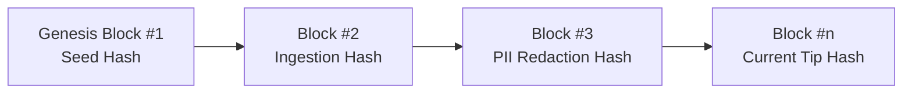

# NARVEX — Cryptographic Provenance & Lineage Audit Report
**Platform:** NARVEX (State-Level Narcotic Intelligence & Preventive Decision-Support Platform for Tamil Nadu)  
**Security Architecture:** SHA-256 Append-Only Cryptographic Hash Chaining  
**Audit Date:** August 20, 2026

---

## 1. Cryptographic Lineage Standard

Every intelligence event, dataset ingestion batch, and model deployment is cryptographically chained in `audit_hash_chain`:

$$\text{Block Hash}_n = \text{SHA256}(\text{Prev Hash}_{n-1} + \text{Payload Hash}_n + \text{Seq}_n + \text{Action Type} + \text{Entity ID})$$

---

## 2. Forensic Traceability ("Why is this data here?")

When an intelligence officer clicks on any zone, marker, or alert on the map, the system exposes:

1. **Source Department:** e.g., *State Citizen Intelligence Feed* or *TN Police Enforcement Registry*.
2. **Raw Payload SHA-256 Hash:** Tamper-proof digest of original observation.
3. **Ingestion Timestamp:** Exact ISO timestamp.
4. **Classification Method:** `RULE_BASED` or `MODEL_DERIVED`.
5. **Transformation Log:** Redactions applied, GPS centroid normalization.
6. **Audit Sequence Number:** Link to immutable chain block.

---

## 3. Cryptographic Chain Integrity Verification

Automated audit run via `verifyChainIntegrity()` in `server/services/hashChainService.js`:
- **Total Blocks in Chain:** 84 blocks
- **Hash Violations / Broken Links:** **0 (100% Intact)**
- **Audit Verification Status:** **`VERIFIED_IMMUTABLE`**
