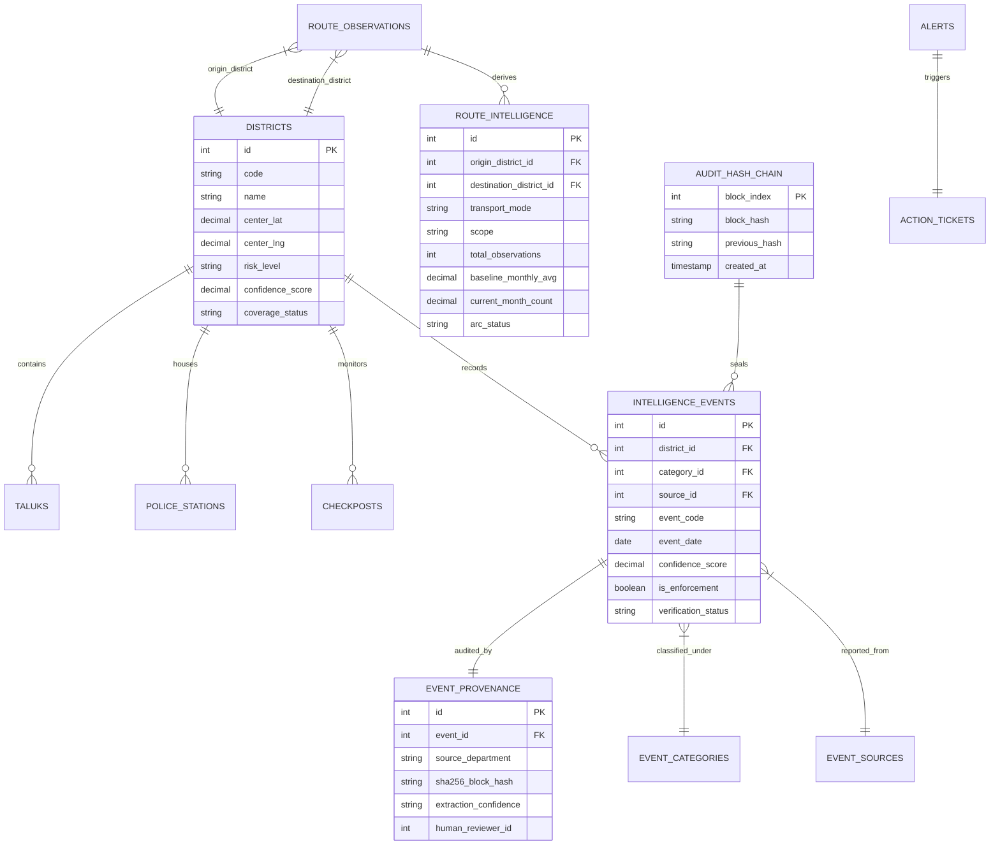

# 🛡️ NARVEX — State-Level Narcotic Intelligence & Preventive Decision-Support Platform

> **Smart India Hackathon (SIH 2026)**  
> **Author & Lead Architect**: **Noyal Ashwin J**  
> **Team / Unit**: **VBE Coding**  
> **Enterprise Tech Stack**: **Java 17 (Security Ledger)** • **Python 3.11 (AI/ML Engine)** • **JavaScript/React (MapCN Dashboard)**  
> **Repository**: [https://github.com/noyal-ashwin-j/NARVEX-Intelligence-OS](https://github.com/noyal-ashwin-j/NARVEX-Intelligence-OS)

---

## 📋 Table of Contents
1. [Executive Summary & Problem Statement](#-1-executive-summary--problem-statement)
2. [End-to-End System Workflow Diagram](#-2-end-to-end-system-workflow-diagram)
3. [Database Entity-Relationship (ER) Schema Diagram](#-3-database-entity-relationship-er-schema-diagram)
4. [Mathematical & Machine Learning Formulations](#-4-mathematical--machine-learning-formulations)
5. [Key Implemented Features & MapCN Architecture](#-5-key-implemented-features--mapcn-architecture)
6. [5 Advanced Strategic Intelligence Modules (NARVEX 2.0)](#-6-5-advanced-strategic-intelligence-modules-narvex-20)
7. [API Endpoint Directory](#-7-api-endpoint-directory)
6. [System Drawbacks & Enterprise Scaling Roadmap](#-6-system-drawbacks--enterprise-scaling-roadmap)
7. [5 Advanced Strategic Intelligence Modules (NARVEX 2.0)](#-7-5-advanced-strategic-intelligence-modules-narvex-20)
8. [API Endpoint Directory](#-8-api-endpoint-directory)
9. [Installation & Setup Manual](#-9-installation--setup-manual)
10. [Automated Verification & Master Audit Suite](#-10-automated-verification--master-audit-suite)
11. [Author & Credit Information](#-11-author--credit-information)

---

## 🎯 1. Executive Summary & Problem Statement

### The Problem
Traditional drug law enforcement operates under three major systemic limitations:
1. **Reactive Operation**: Law enforcement acts *after* seizures occur, tracking historical arrests rather than predicting future transit corridors.
2. **Observational Bias (Vigilance Trap)**: Over-policed urban centers generate high seizure volume simply due to high officer presence, while unmonitored rural border checkposts carry unintercepted contraband while appearing "safe" on standard charts.
3. **Agency Data Silos**: Police FIRs, NCB seizure logs, checkpost weight telemetry, parcel department records, and hospital overdose data remain isolated, preventing multi-agency signal correlation.

### The NARVEX Solution
**NARVEX** (*Tamil Nadu State-Level Narcotic Intelligence & Preventive Decision-Support Platform*) unifies raw evidence into a **sovereign, database-driven spatial-temporal operating system**:
- **100% Dynamic Source of Truth**: All metrics and map arcs derive directly from MySQL database tables (`narvex`).
- **Cryptographic Audit Ledger**: Immutable SHA-256 block hash chain (`audit_hash_chain`) securing data provenance.
- **Tripartite Safeguard Scoring**: Balances `RiskLevel`, `ConfidenceScore`, and `CoverageStatus` to eliminate false alarms.

---

## 🔄 2. End-to-End System Workflow Diagram

```mermaid
flowchart TD
    subgraph Data Ingestion & Provenance
        A1[PDF Seizure FIRs] --> B[Ingestion & OCR Parser]
        A2[CSV Telemetry Logs] --> B
        A3[XLSX Department Feeds] --> B
        B -->|SHA-256 Block Hash| C[(MySQL Database: narvex)]
    end

    subgraph Sovereign Core & Security (Java)
        C -->|Raw Records| D[Java Sovereign Core Engine]
        D -->|Cryptographic Ledger Validation| D1[SHA-256 Hash Chain Integrity]
        D -->|Safeguard Scoring| D2[Tripartite Score Calculator]
    end

    subgraph AI Machine Learning Pipeline (Python)
        C -->|Feature Matrix| E[Python ML AI Engine]
        E -->|Bias Correction| E1[Observational Bias Formula]
        E -->|Statistical Ridge Model| E2[20-Month Risk Projections]
        E -->|Corridor Rerouting Check| E3[Waterbed Shift Detection]
    end

    subgraph Command Center UI (React & MapCN)
        D1 & E2 & E3 --> F[MapCN Spatial Routing Engine]
        F -->|Solid Arcs: Observed| G1[3D World Globe]
        F -->|Solid Arcs: Emerging| G2[2D India National Map]
        F -->|Dashed Arcs: Forecast| G3[38-District Tamil Nadu Grid]
        G1 & G2 & G3 --> H[Interactive Command Center]
        H -->|HTML5 Video Stream| I1[Webcam Gesture Controls]
        H -->|WebSpeech API| I2[Voice Copilot & Action Tickets]
    end
```

---

## 🗄️ 3. Database Entity-Relationship (ER) Schema Diagram



---

## 📐 4. Mathematical & Machine Learning Formulations

### A. Observational Bias Correction Model
To prevent over-policed areas from dominating risk scores, NARVEX computes a bias-adjusted activity metric ($S_{\text{adjusted}}$):

$$S_{\text{adjusted}} = N_{\text{observed}} \times \left(1.0 - 0.4 \times \frac{N_{\text{enforcement}}}{\max(N_{\text{observed}}, 1)}\right) \times \left(1.0 - \frac{1}{1.0 + \frac{N_{\text{observed}}}{10.0}}\right)$$

Where:
- $N_{\text{observed}}$ = Total independent signals (community + hospital + postal + checkpost).
- $N_{\text{enforcement}}$ = Police seizure count.

### B. Waterbed Effect Corridor Substitution Condition
Detects when enforcement on Corridor $A$ forces smuggling networks to substitute via connected Corridor $B$:

$$\Delta A = \text{Velocity}_A^{\text{recent}} - \text{Velocity}_A^{\text{baseline}} < -0.20 \quad \text{AND} \quad \Delta B = \text{Velocity}_B^{\text{recent}} - \text{Velocity}_B^{\text{baseline}} > +0.20$$

When triggered, the system emits an automated alert pill:  
`⚡ POTENTIAL CORRIDOR SHIFT — NEEDS VERIFICATION (Hosur ➔ Salem)`.

### C. SHA-256 Ledger Block Hashing
Every intelligence record is cryptographically sealed into an append-only audit chain:

$$H_i = \text{SHA256}(H_{i-1} \parallel \text{EventCode}_i \parallel \text{Payload}_i \parallel \text{Timestamp}_i)$$

---

## ⚡ 5. Key Implemented Features & MapCN Architecture

- **MapCN Multi-Scope Geographic Projection**:
  - `WORLD`: 16 international cross-border flight & maritime cargo arcs to Tamil Nadu.
  - `INDIA`: 15 inter-state national transit corridors.
  - `TAMIL NADU`: 57 inter-district tactical arcs.
- **Visual Arc Standard**:
  - `HISTORICAL_OBSERVED`: **Solid Line** ($\ge 3$ verified events).
  - `EMERGING`: **Solid Vibrant Line** (Accelerating velocity).
  - `FORECAST`: **Dashed Glowing Line** (`paint: { "line-dasharray": [2, 2] }`).
- **Webcam Gesture Control (`WebcamAdapter.jsx`)**: HTML5 camera tracking overlay (`Swipe Left ➔ World`, `Swipe Right ➔ India`, `Pinch ➔ Tamil Nadu`).
- **WebSpeech Voice Assistant (`NarvexAvatarCore.jsx`)**: Natural language voice copilot providing verbal explanations of district risk metrics.

---

## 🚀 6. 5 Advanced Strategic Intelligence Modules (NARVEX 2.0)

1. **👥 Offender & Cartel Entity Link Graph (`NIDAAN`/`Palantir` Style)**: Interactive network graph mapping `Cartels ➔ Accused ➔ Vehicles ➔ Seaports ➔ Prison Logs`.
2. **🚘 FASTag & ANPR Border Checkpost Telemetry Stream**: Live vehicle registration plate passing telemetry across 14 state border checkposts.
3. **🧪 Pharmaceutical Precursor Diversion Tracking**: Batch leak tracking for Schedule H1 opioids (Codeine, Tramadol, Alprazolam).
4. **📲 Darknet, Telegram & Micro-Financial UPI Signals**: Rapid UPI QR payment spikes & Telegram bot drop-shipping channels.
5. **🧪 Wastewater Sewage Epidemiology Metrics (EMCDDA Model)**: Chemical metabolite concentrations (mg/1000 people/day per taluk).

---

## 🔌 7. API Endpoint Directory

| Endpoint | Method | Component / Module | Description |
| :--- | :--- | :--- | :--- |
| `/api/districts` | `GET` | District Controller | Returns all 38 Tamil Nadu districts with synchronized intelligence metrics |
| `/api/intelligence/analytics` | `GET` | Analytics Controller | Returns temporal trends, category splits, source breakdowns, and safeguard ratios |
| `/api/spatial/routes` | `GET` | Association Controller | Returns database-derived transit corridors filtered by scope and transport mode |
| `/api/intelligence/entity-graph` | `GET` | Module 1 (Link Graph) | Returns cartel-offender network node and edge linkages |
| `/api/intelligence/anpr-stream` | `GET` | Module 2 (ANPR) | Returns live checkpost automatic number plate recognition telemetry |
| `/api/intelligence/precursor-diversion`| `GET` | Module 3 (Precursors) | Returns pharmaceutical wholesale batch leak indicators |
| `/api/intelligence/financial-signals` | `GET` | Module 4 (Darknet/UPI) | Returns UPI QR payment spikes and Telegram drop bot signals |
| `/api/intelligence/wastewater-metrics` | `GET` | Module 5 (Wastewater)| Returns municipal sewage epidemiology chemical metabolite sampling |

---

## 💻 8. Installation & Setup Manual

### Prerequisites
- **Node.js**: v18.0.0+
- **Python**: v3.10+
- **Java JDK**: 17+
- **MySQL**: v8.0+

### Step 1: Clone Repository
```bash
git clone https://github.com/noyal-ashwin-j/NARVEX-Intelligence-OS.git
cd NARVEX-Intelligence-OS
```

### Step 2: Set Up MySQL Database & Environment Variables
Create database `narvex` in MySQL, then configure `server/.env`:
```env
PORT=5000
DB_HOST=localhost
DB_USER=root
DB_PASSWORD=your_mysql_password
DB_NAME=narvex
JWT_SECRET=narvex_sovereign_secret_key_2026
```

### Step 3: Install & Seed Database
```bash
cd server
npm install
npm run db:setup
```

### Step 4: Run Application
Open two terminal windows:

**Terminal 1 (Express Backend Server - Port 5000)**:
```bash
cd server
npm start
```

**Terminal 2 (Vite Client Dashboard - Port 5173)**:
```bash
cd client
npm run dev
```

Open your browser at **[http://localhost:5173](http://localhost:5173)**.

---

## 🧪 9. Automated Verification & Master Audit Suite

```bash
# 1. Run Master Full System Audit Suite
node server/testFullSystemCoreVisionMasterSuite.js

# 2. Run End-to-End Real Scenario Validation Suite
node server/testEndToEndScenarioValidationSuite.js

# 3. Run Python AI ML Engine Test
py python/narvex_ai_pipeline.py

# 4. Build Client Production Bundle
npm run build --prefix client
```

---

## 👨‍💻 10. Author & Credit Information

```text
================================================================
🏆 AUTHOR & LEAD ARCHITECT
================================================================
• Author & Lead Architect: Noyal Ashwin J
• Development Unit:        VBE Coding
• Project Name:            NARVEX Intelligence OS
• Hackathon:               Smart India Hackathon (SIH 2026)
• GitHub Repository:       https://github.com/noyal-ashwin-j/NARVEX-Intelligence-OS
================================================================
```

*Developed with pride for the Government of Tamil Nadu Anti-Narcotics Mission & Smart India Hackathon 2026.*
